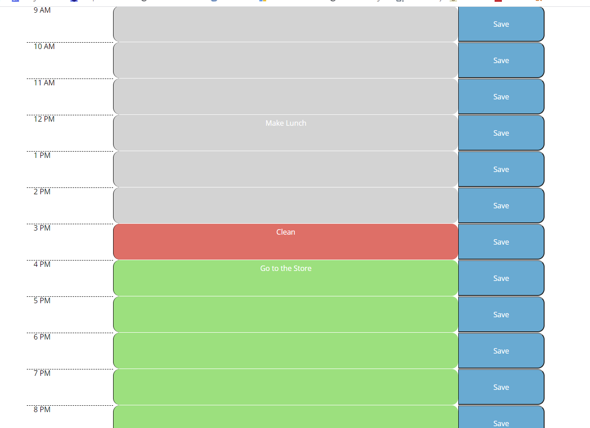

This program is a planner that displays the current day and a series of timeblocks that can be edited with tasks that can be saved to local storage. As the day goes on, the website will display past hours in grey boxes, the current hour in red, and future hours in green.

Planner Example:
